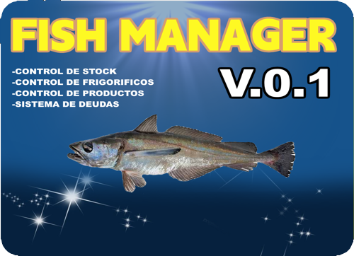
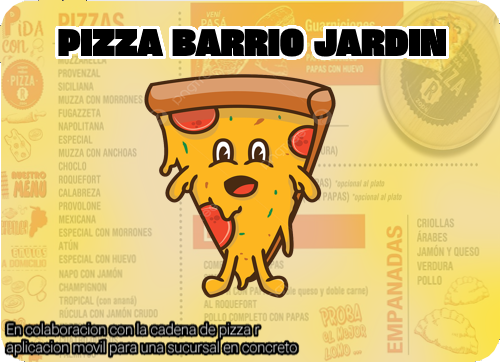

```JavaScript
const aboutMe = {
  name: 'Juan Ariel Ortiz Iacampo',
  age: '25 years old';
  softSkills: [
    'creativity',
    'empathy',
    'organization'
  ]
};

function contatcMe() {
  return 'Linkedin: https://www.linkedin.com/in/juan-ariel-ortiz-/ ';
}
```


<P> 🌟 Hello! I’m Juan Ariel, a passionate software engineer with a degree in Systems Analysis, specializing in fullstack development. Are you looking for a dedicated, experienced professional eager for new challenges?

That's me!</P>


<div align="center">
  <a href="https://www.linkedin.com/in/juan-ariel-ortiz-/" target="_blank" rel="external"></a>
  <a href="mailto:juanarielok@gmail.com" target="_blank"></a>
  
  <a href="        /" target="_blank"></a> 
</div>


<h1 align="center">Skills</h1>

<div align="center">
  
  
  
  
  
  
  
  
  
  
  
  
  
  
  
  
  
  
  
  
  
  
</div>
<h1 align="center">Languages</h1>
<div align="center">
  
  
  
</div>


<h1 align="center">Main Projects</h1>

<table>
  <tr>
    <td valign="top" width="50%">
      <h2 align="center"><a href="https://github.com/Juanarielok/Fish-Manager-2021">FISH MANAGER beta</a></h2>
      <a href="https://github.com/Juanarielok/Fish-Manager-2021"></a>
      <br>
      <br>
           <p><em><strong>:wrench: Tools/Methodologies:</strong> Tools and methodologies used for this project</em></p>
      <p>:us: Brief description in English</p>
      <p>:brazil: Breve descrição em português</p>
    </td>
    <td valign="top" width="50%">
      <h2 align="center"><a href="https://github.com/Juanarielok/BarrioJardin-Pizzeria">Repository 2</a></h2>
      <a href="https://github.com/Juanarielok/BarrioJardin-Pizzeria"></a>
      <br>
      <br>
          <p><em><strong>:wrench: Tools/Methodologies:</strong> Tools and methodologies used for this project</em></p>
      <p>:us: React, Javascript, HTML, SCSS, Node.js</p>
      <p>A platform to manage deliveries more cheaper- WIP</p>
    </td>
  </tr>
  <tr>
    <td valign="top" width="50%">
      <h2 align="center"><a href="https://github.com/Juanarielok/repository3">Repository 3</a></h2>
      <a href="https://github.com/Juanarielok/repository3"></a>
      <br>
      <br>
      <p><em><strong>:wrench: Tools/Methodologies:</strong> Tools and methodologies used for this project</em></p>
      <p>:us: Brief description in English</p>
      <p>:spanish: Breve descrição em português</p>
    </td>
    <td valign="top" width="50%">
      <h2 align="center"><a href="https://github.com/Juanarielok/repository4">Repository 4</a></h2>
      <a href="https://github.com/Juanarielok/repository4"></a>
      <br>
      <br>
      <p><em><strong>:wrench: Tools/Methodologies:</strong> Tools and methodologies used for this project</em></p>
      <p>:us: Brief description in English</p>
      <p>:brazil: Breve descrição em português</p>
    </td>
  </tr>
</table>
<br>


<h1 align="center">GitHub Statistics</h1>

<div align="center">
  <a href="https://github.com/anuraghazra/github-readme-stats">
    
  </a>
  <a href="https://github.com/anuraghazra/github-readme-stats">
    
  </a>
  <a href="https://git.io/streak-stats">
    
  </a>
  <br>
  <br>
  <div>
    <p>Profile views since 11/21/2021:</p>
    <p></p>
  </div>
</div>


