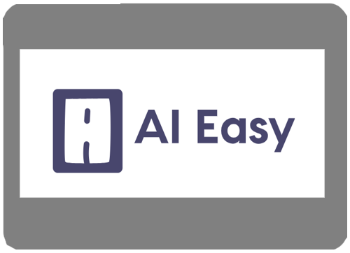

<h1 align="center">Main Projects</h1>

<table>
  <tr>
    <td valign="top" width="50%">
      <h2 align="center"><a href="https://github.com/Juanarielok/Fish-Manager-2021">██▓▒­░⡷⠂𝙵𝙸𝚂𝙷 𝙼𝙰𝙽𝙰𝙶𝙴𝚁⠐⢾░▒▓██</a></h2>
      
       
       
           
<em><strong>:wrench: Tools/Methodologies:</strong> Tools and methodologies used for this project</em>

     
C#, XML

      
The ultimate fish manager! Control your stock, types of seafood, freezers, customers and more! BETA VERSION 

    </td>
    <td valign="top" width="50%">
      <h2 align="center"><a href="https://github.com/Juanarielok/BarrioJardin-Pizzeria">｡.✰ PIZZERIA "BARRIO JARDIN" ✰.｡</a></h2>
      
       
       
          
<em><strong>:wrench: Tools/Methodologies:</strong> Tools and methodologies used for this project</em>

      
React, Javascript, HTML, SCSS, Node.js

      
Presenting an innovative platform designed to optimize delivery management, promising not only enhanced efficiency but also significant cost savings. Currently a work in progress, stay tuned for its grand unveiling! - WIP

    </td>
  </tr>
  <tr>
    <td valign="top" width="50%">
      <h2 align="center"><a href="https://github.com/Juanarielok/easyai"> 𝐄𝐚𝐬𝐲 𝐀𝐈</a></h2>
      
       
       
      
<em><strong>:wrench: Tools/Methodologies:</strong> Tools and methodologies used for this project</em>

     
React, Javascript, HTML, SCSS, Node.js, SQL, Jira, Figma

      
Basically a "chatgpt" for students to summarize academic text, books and study material - WIP

    </td>
    <td valign="top" width="50%">
      <h2 align="center"><a href="https://github.com/Juanarielok/repository4">✵✵𝘾𝙊𝙈𝙐𝙉𝙄𝙏𝘼𝙍𝙄𝙊 𝓢𝓽𝓸𝓻𝓮✵✵</a></h2>
      
       
       
      
<em><strong>:wrench: Tools/Methodologies:</strong> Tools and methodologies used for this project</em>

      
React, Javascript, HTML, SCSS, Node.js

      
A platform that will help the producers and consumers avoid intermediaries and innecesary taxes, this project it's going to bring a HUGE change - WIP

    </td>
  </tr>
</table>
 

<h1 align="center"></h1>

